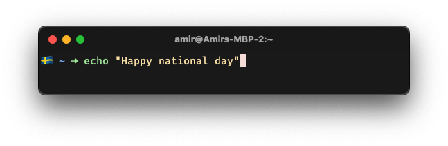

# swe-holiday-prompt.zsh
Adds an emoji to you Zsh prompt if the current day is a national Swedish holiday



## Installation
Download to `~/.zsh/swe-holiday-prompt.zsh`
```bash
curl -LSso ~/.zsh/swe-holiday-prompt.zsh --create-dirs https://raw.githubusercontent.com/amimof/swe-holiday-prompt.zsh/main/swe-holiday-prompt.zsh
```
Put this in your `~/.zshrc`
```bash
[ -f ~/.zsh/swe-holiday-prompt.zsh ] && source ~/.zsh/swe-holiday-prompt.zsh
```

## Can I add custom dates?
Open up `swe-holiday-prompt.zsh` and add a range of dates with `_add_range()`